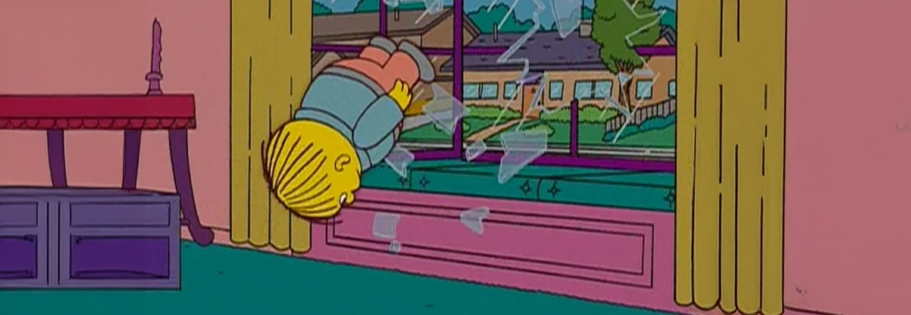

# Ralph - Dockerized Claude in Unrestricted Mode

## What is the Ralph Technique?

Ralph is an AI-assisted software development technique [created by Geoffrey Huntley](https://ghuntley.com/ralph/). At its core, it's a bash loop that repeatedly pipes a prompt into Claude Code:

```bash
while :; do cat PROMPT.md | claude ; done
```

The idea is **iterative refinement through eventual consistency** — rather than crafting a single perfect prompt, you run the same instructions in a loop and let the AI incrementally build, fix, and improve the codebase over multiple passes. When results aren't right, you tune the prompt — "like tuning a guitar" — instead of blaming the tools.

This project packages that loop into a Docker container with full permissions so you can point it at a workspace and let it run a set number of times (or indefinitely).

## Features

- **Dockerized loop** — runs Claude CLI with `--dangerously-skip-permissions` and full sudo, so no prompts interrupt the cycle
- **Auto-exit hook** — a container hook (`stop-and-exit.sh`) terminates Claude at the end of each pass so the loop can restart cleanly
- **Configurable iterations** — run indefinitely or set a cap with `MAX_ITERATIONS`
- **10 custom subagents** — the container ships with a full SDLC team defined in `.claude/agents/`: Product Manager, Software Architect, Software Developer, UX Designer, QA Engineer, Security Engineer, Performance Engineer, DevOps Engineer, Release Manager, and Technical Writer
- **Ready-made prompt template** — `.ralph/prompt.md.template` is preconfigured to orchestrate those agents iteratively: break a goal into tasks, delegate each task to the right subagent one at a time, track progress in `.ralph/`, and loop back for review and cleanup
- **Example SDLC archives** — `docs/.ralph/Archives/` contains full examples (a Minesweeper game, an interactive agent inventory chart, and a marketing pitch) complete with requirements, architecture docs, QA reports, security audits, and final status write-ups
- **Dual auth** — supports both OAuth tokens and API keys (OAuth takes priority)

## Quick Start

```bash
# Copy .env.template to .env
cp .env.template .env

# Set ONE of these authentication methods in .env:
# Option 1: OAuth token (recommended for long-lived sessions)
#   Generate with: claude setup-token
#   Set: CLAUDE_CODE_OAUTH_TOKEN=your-token-here
#
# Option 2: API key
#   Set: ANTHROPIC_API_KEY=your-api-key-here

# Build and run with a workspace directory
make ralph WORKSPACE=/path/to/your/project
```

## Usage

### Build

```bash
make build      # Build runtime image
make build-test # Build test image
```

### Test

```bash
make test       # Run tests in Docker
```

### Run

```bash
# Basic usage - runs indefinitely until manually stopped
make ralph WORKSPACE=/path/to/workspace

# With iteration limit
make ralph WORKSPACE=/path/to/workspace MAX_ITERATIONS=5
```

### Options

| Option | Description | Default |
|--------|-------------|---------|
| `WORKSPACE` | Directory to mount as `/workspace` (must contain `.ralph/prompt.md`) | Required |
| `MAX_ITERATIONS` | Maximum loop iterations (0 = unlimited) | 0 |

## How It Works

1. The container mounts your workspace directory to `/workspace`
2. On each iteration, it reads `.ralph/prompt.md` and pipes it to Claude
3. Claude runs with `--dangerously-skip-permissions` (no tool restrictions)
4. The loop continues until `MAX_ITERATIONS` is reached (or forever if 0)

## Prompt File

Create a `.ralph/prompt.md` file in your workspace directory with instructions for Claude:

```bash
mkdir -p /path/to/your/project/.ralph
cp .ralph/prompt.md.template /path/to/your/project/.ralph/prompt.md
# Edit the file with your instructions
```

The included template (`.ralph/prompt.md.template`) sets up an agent-driven SDLC workflow out of the box. You insert your goal at the top, and Ralph will:

1. Break the goal into granular tasks
2. Delegate each task to the most appropriate subagent (e.g. `software-developer`, `qa-engineer`)
3. Track progress in `.ralph/` markdown files
4. Run review and cleanup passes after all tasks complete
5. On the next iteration, pick up where it left off or find incremental improvements

## Examples

The `docs/` directory contains worked examples that were built entirely by Ralph. Browse them all at [mesolimbo.github.io/ralph](https://mesolimbo.github.io/ralph/). Highlights:

| Example | Description |
|---------|-------------|
| [**Minesweeper**](https://mesolimbo.github.io/ralph/examples/minesweeper.html) | Retro Windows 95-style game — single HTML file, zero dependencies, ~650 LOC |
| [**Agent Inventory**](https://mesolimbo.github.io/ralph/examples/inventory.html) | Interactive orbital chart of the 10 SDLC agents with filtering and dark mode |

Full SDLC archives for each (requirements, architecture, QA reports, security audits, etc.) live in `docs/.ralph/Archives/`.

## Security Warning

This container runs Claude with **no permission restrictions** and **full sudo access**. Only use it:
- In isolated environments
- With trusted prompt files
- On non-sensitive codebases
- Use at your own risk 💀

## Requirements

- Docker
- Claude Code CLI installed (`npm install -g @anthropic-ai/claude-code`)
- Authentication via one of:
  - OAuth token (generate with `claude setup-token`) - set `CLAUDE_CODE_OAUTH_TOKEN` in `.env`
  - API key - set `ANTHROPIC_API_KEY` in `.env`
- Note: If both are set, OAuth token takes priority

